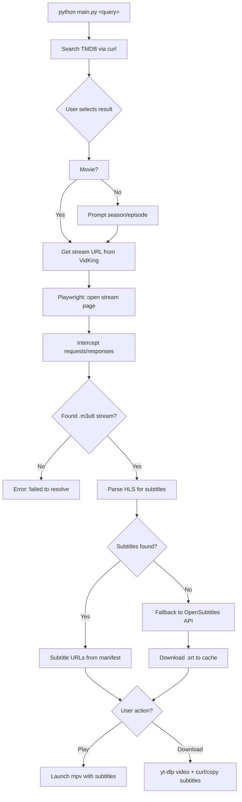

# 🎬 Movie CLI Pro

A blazing-fast, beautiful terminal UI for searching, streaming, and downloading movies and TV shows directly from your command line.

> **Note:** This entire project was 100% **vibe coded**. We didn't write massive design docs or overthink the architecture; we just caught a wave of momentum, relied on intuition, and built something awesome. 🌊

## ✨ Features

- **Unified Search:** Instantly query TMDB for both Movies and TV Shows.
- **Smart Resolver:** Uses headless browser automation (Playwright) to sniff out hidden `.m3u8` streams and subtitle tracks from HLS manifests.
- **Multi-Source Subtitles:** Extracts embedded VTT/SRT/ASS subtitles from streams, parses HLS `#EXT-X-MEDIA` tags, and falls back to OpenSubtitles API when nothing is found.
- **Subtitle Download:** Subtitles are saved alongside video files when downloading.
- **Zero-Dependency HTTP:** Uses `curl` subprocess calls instead of `requests` — no Python HTTP library needed.
- **Beautiful UI:** Powered by `rich` for animated spinners, colorful tables, and interactive terminal menus.
- **Built-in Watchlist & History:** Save shows for later, and mark them as watched to build your personal streaming diary right in your terminal.
- **Data Hoarder Mode:** Pass the `-d` flag to intercept the stream and download it straight to your drive using `yt-dlp`, with subtitles bundled alongside.

## 🛠️ Prerequisites

- `mpv` (The media player)
- `yt-dlp` (For resolving and downloading)
- `curl` (For API calls and subtitle downloads)
- Python 3.8+

## 🚀 Installation & Setup

1. Clone the repository:
   ```bash
   git clone https://github.com/dumbL4d/movie-cli.git
   cd movie-cli
   ```

2. Install the required Python libraries:
   ```bash
   pip install rich playwright
   ```

3. Install the Playwright browser engine (required for bypassing stream protections):
   ```bash
   playwright install chromium
   ```

4. Set up your API keys:
   ```bash
   cp .env.example .env
   ```
   Then edit `.env` with your keys from [TMDB](https://www.themoviedb.org/) and [OpenSubtitles](https://opensubtitles.com).

## 🔑 Configuration

This CLI uses TMDB for metadata and optionally OpenSubtitles for subtitle fallback.

Create a `.env` file in the project root:

```env
TMDB_API_KEY=your_tmdb_api_key
OPENSUBTITLES_API_KEY=your_opensubtitles_api_key
```

## 🎮 Usage

**Search for a movie or TV show:**
```bash
python main.py the matrix
```

**Open your Watchlist:**
```bash
python main.py -w
```

**View your Watched History:**
```bash
python main.py -H
```

**Force Download Mode directly from search:**
```bash
python main.py interstellar -d
```

## 🔄 Flow



## 🗺️ Project Structure

```
.
├── main.py                  # Entry point — loads .env, runs CLI
├── cli.py                   # Argument parsing, search, watchlist, dispatch
├── core/
│   ├── dotenv.py            # Zero-dependency .env loader
│   ├── cineby_api.py        # TMDB search + VidKing URL builder via curl
│   ├── resolver.py          # Playwright-based stream & subtitle resolver
│   ├── player.py            # mpv launcher with subtitle support
│   ├── downloader.py        # yt-dlp wrapper with subtitle download
│   ├── subtitles.py         # OpenSubtitles API client via curl
│   └── storage.py           # JSON-based watchlist/history persistence
├── .env.example             # Template for API keys
└── .gitignore
```
